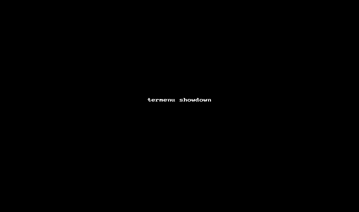

Abstract
========

Termenu is a command line utility and Python library for displaying console
based interactive menus.

Description
===========

Traditionally there are two types of applications running the Unix shell: pure
command line utilities such as grep, sed and awk and full screen interactive
applications such as Midnight Commander. Termenu aims to bridge this gap and
allow a modicum of interactivity in regular command line utilities. A common
example is finding and editing a file located somewhere in the directory tree.

The usual way to do this is to run:

    $ find . -name "*.py"

This will shown a list of files in the current directory and its
sub-directories:

    ./lib/keyboard.py
    ./lib/ansi.py
    ./termenu.py

Now you need to write a command to start the editor, using the mouse (gasp!) to
copy and paste the required filename to the command line, like so:

    $ vim ./lib/keyboard

In its simplest use-case, termenu allows you to choose one or more of the lines
you pass to it in an interactive way. The following command will allow you to
choose one or more of the files returned by the ``find`` command:

    $ find . -name "*.py" | termenu

A simple modification will start the ``vim`` editor with the selected files:

    $ vim `find . -name "*.py" | termenu`

Usage
=====

    Usage: termenu [items]

    Options:
      --help                Show help message
      -f FILE, --file=FILE  Take menu items from a file
      -t TITLE, --title=TITLE
                            A title for the menu
      -d OPTION, --default=OPTION
                            Default item to select
      -h N, --height=N      Max height [10]
      -w N, --width=N       Max width [terminal width]
      -o, --one             Don't show a menu if only one option was given
      -p, --precolored      Preserve ANSI coloring in supplied options
      -i, --inline          Show small inline menu on a single line
      --single              Single selection only

Examples
========

Show the contents of a recent commit in ``git``:

    $ git show `git log --oneline --color | termenu -p | awk '{print $1}'`

Ask a multiple choice question:

    $ echo -n "Would you like to exit? " && ./termenu -i Yes No Maybe

See Also
========

If you like termenu, you may find [gitter](http://github.com/elifiner/gitter) interesting as well. It's a termenu based git client that acts exactly like the standard command line git but shows a menu whenever appropriate. It's similar to how git works under zsh, but works with standard shells and has smarter menus.

Name
====

Oh, and if you were wondering, termenu is a combination of the words *terminal* and *menu*.
